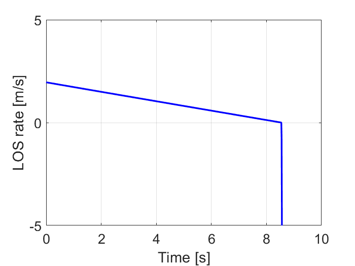
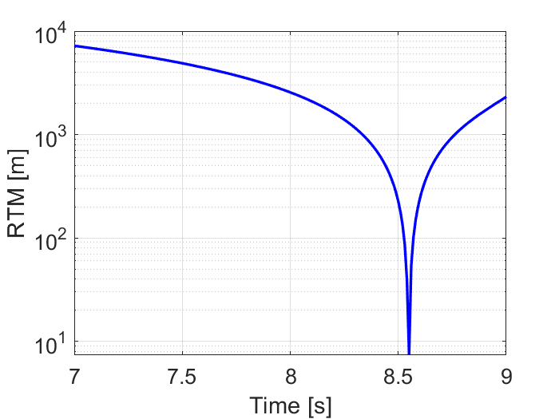
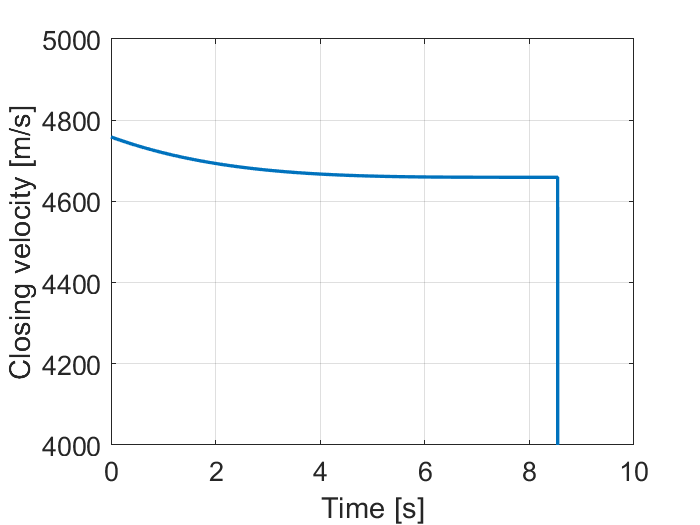
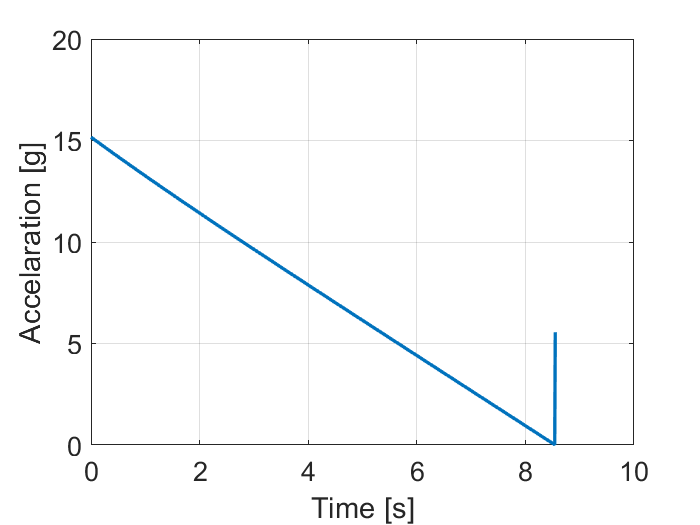

# Engagement-simulator #

The simulation occurs in 2D only, assumes head-on collision and does not consider manoeuvrability limitations of a pursuer. 

The program simulates the engagement scenarios in 3 steps: 
* Setting initial condition
* Application of Pro-Nav laws and integration with RK4
* Post-processing output

In case program compiles with the following initial conditions:

Parameter | Value
-----|---------
Pro-Nav type | True
Target accelareration | 0
Heading error | -20°
Proportianility const N | 3
∠(Target Velocity, horizon) |  0
Initial position of pursuer | (0 , 10000) m
Initial position of target | (40000,10000) m
Pursuer speed | 4000 m/s
Target speed | 1000 m/s

Then we can obtain two general visualizations:
Full engagement:

https://github.com/Arseni10Lk/Engagement-simulator/blob/master/Media/Full_engagement_20deg_HE_True.mp4

Engagement zoomed on the pursuer: 

https://github.com/Arseni10Lk/Engagement-simulator/blob/master/Media/Zoomed_engagement_20deg_HE_True.mp4

And visualizations of particular parameter values:
Parameter | Graph
-----|---------
Line of sight angle change rate | 
Pursuer to target distance (on a log scale) | 
Closing Velocity | 
Pursuer acceleration | 

In order to see results for different initial conditions you have to change the first section with the initial conditions (obviously) and also the third section wth visualizations.
